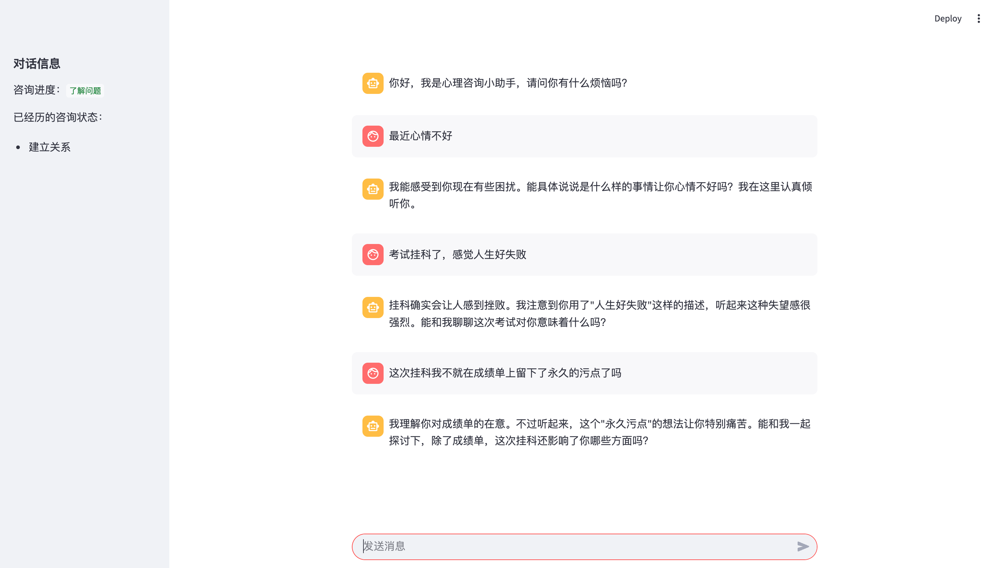
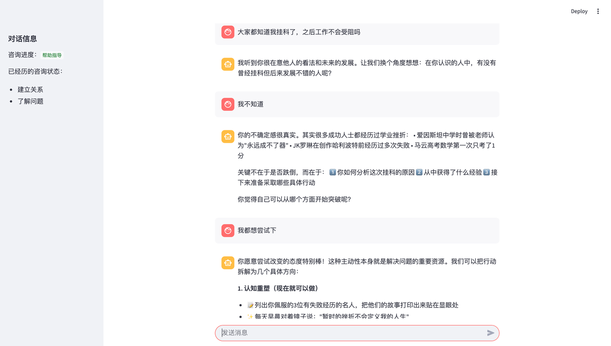
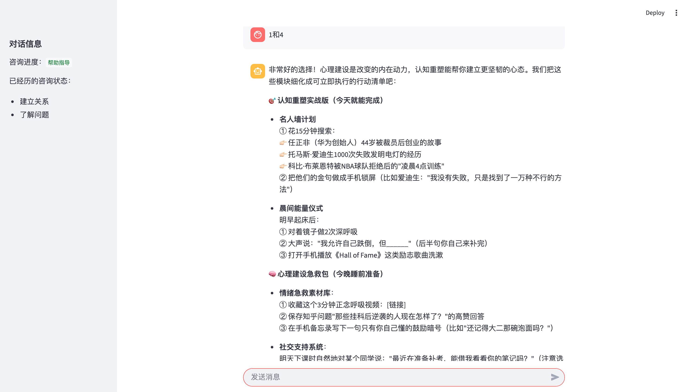

# 一个简单的心理咨询Agent

## 心理咨询师Agent流程介绍

心理咨询可以简单划分为五个流程阶段：建立关系--理解问题--分析诊断--帮助指导--结束关系。

搭建一个Agent最关键的是如何把行业的思维认知迁移到Agent内。

对于心理咨询则是，我们如何让大模型Agent能够理解当前对话的状态，以及下一步对话该做什么事情，每一个状态该做出哪种行为？

于是，我们可以搭建两个Agent：

- 咨询师Agent：负责与用户对话，推动咨询聊天的进行
- 状态评估Agent：负责评估当前的对话状态，切换咨询的流程阶段 ，以推进咨询任务的完成

# Demo效果展示

运行 `uv run streamlit run app.py` 。

